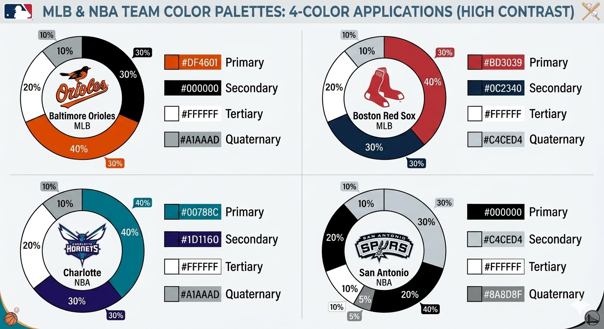
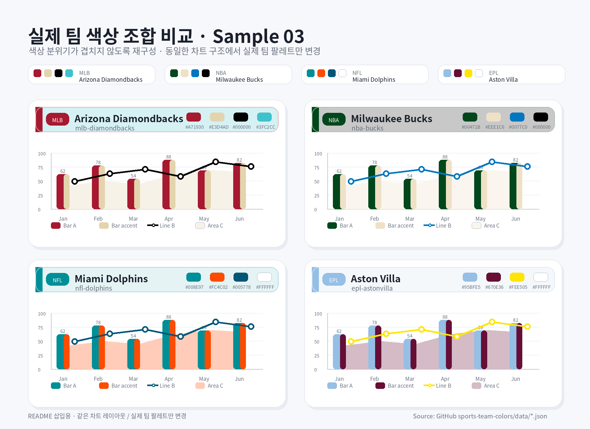

# Sports Team Colors

A data-driven project providing comprehensive color schemes (up to 4 colors per team) and high-quality logos for NBA, NFL, MLB, and EPL teams.

## Data Structure

Each league has its own JSON file in the `data/` directory. Teams now feature a full color palette:

```json
{
    "id": "mlb-dodgers",
    "num_id": 114,
    "name": "Los Angeles Dodgers",
    "logo_url": "https://a.espncdn.com/i/teamlogos/mlb/500/lad.png",
    "colors": {
        "primary": "#005A9C",
        "secondary": "#EF3E42",
        "tertiary": "#FFFFFF",
        "quaternary": "#A1AAAD"
    }
}
```

## Visual Reference (Sample)

### Color Palette Applications



## Full Dataset
Check the `data/` folder for the full list of 112 teams across 4 leagues.
